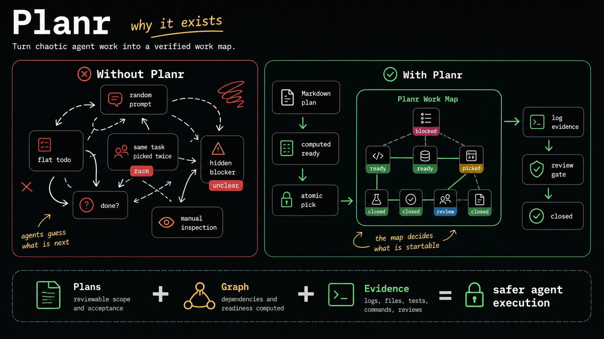

# Planr


Planr is a local-first planning and execution coordination tool for coding agents. It combines reviewable Markdown plans with a dependency-aware work map so Codex, Claude Code, Cursor, generic MCP clients, and human operators can drive the same work safely — from idea to verified completion.

```text
idea -> product plan -> build plan -> map -> pick -> log -> review/evidence -> close
```

## Why Planr



Flat todo lists break down the moment real work has structure. Planr models work as a dependency graph because that is what work actually is:

- **Readiness is computed, not guessed.** An item becomes `ready` only when its blockers are closed; `planr pick` returns work that is actually startable.
- **Parallel agents need atomic claims.** Picks are atomic claims enforced by the database — one item, one owner, no checklist races.
- **"Done" is gated, not asserted.** Closure requires log-backed evidence (files, commands, tests) and open reviews block their target.
- **State survives sessions.** Markdown plans hold scope and acceptance criteria; the SQLite graph holds live status across handoffs, restarts, and agent switches.
- **Failure is structured.** Stale picks, timeouts, and retries are detectable and recoverable (`planr recover sweep`).

Three layers make that work: **Plans** (reviewable Markdown packages), the **Map** (live dependency graph with picks, reviews, logs), and **Agent loops** (skills, CLI, and MCP workflows for every major coding agent). Full model: [Task Graph Model](docs/TASK_GRAPH_MODEL.md) and [Operating Model](docs/OPERATING_MODEL.md).

## Install

```bash
brew install instructa/tap/planr
```

Or with the release installer:

```bash
curl -fsSL https://raw.githubusercontent.com/instructa/planr/main/scripts/install.sh | sh
```

Then initialize a project (also provisions the worker/reviewer subagent roles for your client):

```bash
planr project init "My Product" --client all
```

Manual downloads, from-source builds, and client wiring details: [Install Guide](docs/INSTALL.md).

## Install The Plugin (Skills)

The plugin under `plugins/planr` carries the nine Planr skills plus the `planr-worker` and `planr-reviewer` subagent roles. The `planr` CLI (above) is required separately.

<a id="install-plugin-codex"></a>
<details>
<summary><strong>Codex</strong></summary>

```bash
codex plugin marketplace add instructa/planr
codex plugin add planr@planr
```

</details>

<a id="install-plugin-claude-code"></a>
<details>
<summary><strong>Claude Code</strong></summary>

Inside a Claude Code session:

```text
/plugin marketplace add instructa/planr
/plugin install planr@planr
```

Restart Claude Code afterwards. Skills are namespaced (`/planr:planr`, `/planr:planr-loop`), and the plugin registers the `planr-worker` and `planr-reviewer` subagents automatically.

</details>

<a id="install-plugin-cursor"></a>
<details>
<summary><strong>Cursor</strong></summary>

Pending marketplace review. Until the plugin is listed, wire Planr in via MCP and the CLI prompt:

```bash
planr install cursor        # writes .cursor/mcp.json
planr prompt cli --client cursor
```

</details>

<a id="install-plugin-opencode"></a>
<details>
<summary><strong>opencode</strong></summary>

No plugin yet. Use Planr as an MCP server and paste the CLI prompt into your agent instructions:

```bash
planr mcp                   # stdio MCP server
planr prompt cli
```

</details>

## Tell Your Agent

Two skills drive everything. `$planr` routes any request to the right stage skill from live map state; `$planr-loop` drives one feature through work, live verification, and independent review until the map is clean.

Start a new product from an idea:

```text
Use $planr.

Create a production-ready Habit Tracker web app plan. Create the product plan,
split an MVP build plan, check it, then build the Planr map. Do not implement yet.
```

Ship one feature autonomously until verified:

```text
Use $planr-loop.

Goal: ship the weekly overview feature. DONE when every in-scope map item is closed
with log evidence, all reviews are closed complete, and a live verification log shows
the feature working in the browser. Iteration budget: 10.
```

Mid-project work (a new feature, refactor, or fix on an existing project) works the same — it gets its own feature-scoped plan and extends the existing map. Both journeys with example prompts: [Two Journeys](docs/SKILLS.md#two-journeys-new-project-vs-existing-project). Watch progress anytime with `planr map show`.

## Docs

- [Install](docs/INSTALL.md)
- [Skills](docs/SKILLS.md)
- [Long-Running Goals](docs/GOALS.md)
- [CLI Reference](docs/CLI_REFERENCE.md)
- [MCP Guide](docs/MCP_GUIDE.md)
- [Codex](docs/CODEX.md) · [Claude Code](docs/CLAUDE_CODE.md) · [Cursor](docs/CURSOR.md)
- [Operating Model](docs/OPERATING_MODEL.md)
- [Task Graph Model](docs/TASK_GRAPH_MODEL.md)
- [Architecture](docs/ARCHITECTURE.md)
- [Testing](docs/TESTING.md)
- [Troubleshooting](docs/TROUBLESHOOTING.md)
- [Specification Package](docs/planr-spec/README.md)
- More: [Changelog](CHANGELOG.md), [Import](docs/IMPORT.md), [Security](docs/SECURITY.md), [Handoffs And Stories](docs/HANDOFFS_AND_STORIES.md), [npm Package](docs/NPM.md)

## License

MIT. See `LICENSE.md`.
