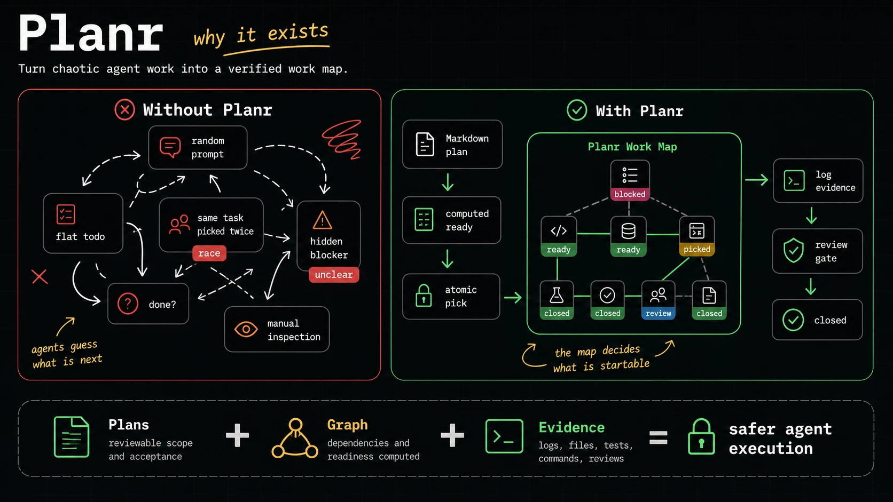

# Planr


Planr is a local-first planning and execution coordination tool for coding agents. It combines reviewable Markdown plans with a dependency-aware work map so Codex, Claude Code, Cursor, Grok Build, generic MCP clients, and human operators can drive the same work safely — from idea to verified completion.

[**View the Demo →**](https://x.com/kevinkern/status/2066957434564808884?s=20)

[**Documentation →**](https://planr.so/docs)

```text
idea -> product plan -> build plan -> map -> pick -> log -> review/evidence -> close
```

## Why Planr



Flat todo lists break down the moment real work has structure. Planr models work as a dependency graph because that is what work actually is:

- **Readiness is computed, not guessed.** An item becomes `ready` only when its blockers are closed; `planr pick` returns work that is actually startable.
- **Parallel agents need atomic claims.** Picks are atomic claims enforced by the database — one item, one owner, no checklist races.
- **"Done" is gated, not asserted.** Closure requires log-backed evidence (files, commands, tests) and open reviews block their target.
- **State survives sessions.** Markdown plans hold scope and acceptance criteria; the SQLite graph holds live status across handoffs, restarts, and agent switches.
- **Failure is structured.** Stale picks, timeouts, and retries are detectable and recoverable (`planr recover sweep`).

Three layers make that work: **Plans** (reviewable Markdown packages), the **Map** (live dependency graph with picks, reviews, logs), and **Agent loops** (skills, CLI, and MCP workflows for every major coding agent). Full model: [Task Graph Model](https://planr.so/docs/concepts/graph-and-readiness) and [Operating Model](https://planr.so/docs/guides/daily-worker-loop).

## Install

```bash
brew install instructa/tap/planr
```

Or via npm (ships platform-native binaries, no toolchain needed):

```bash
npm install -g planr
```

Or with the release installer:

```bash
curl -fsSL https://raw.githubusercontent.com/instructa/planr/main/scripts/install.sh | sh
```

<!-- planr:linux-release-portability:start surface=README schema=1 -->
> **Linux release portability — corrected**
>
> Contract state: `status=corrected`; `affectedThrough=v1.7.2`; `correctedFrom=v1.7.3`.
> Published Linux release, installer, and npm binaries through v1.7.2 require GLIBC_2.39; macOS is unaffected.
> Starting with v1.7.3, current Linux release, installer, and npm artifacts are static-musl executables and do not require glibc.
> On an affected Linux release, build from source on the target distribution or upgrade to v1.7.3.
<!-- planr:linux-release-portability:end surface=README schema=1 -->

Then initialize a project. When selected, Claude Code and Cursor also receive standalone project worker/reviewer roles; Codex workflow skills come from its plugin. Grok Build is a separate explicit opt-in and is not included by `all`:

```bash
planr project init "My Product" --client all
```

Manual downloads, from-source builds, and client wiring details: [Install Guide](https://planr.so/docs/getting-started/installation).

## Install The Plugin (Skills)

The plugin under `plugins/planr` carries the ten Planr workflow skills. Optional model-routing declarations live in repository-local files such as `.planr/agents.toml` and `.planr/policy.toml`; external tools may manage those files, but Planr does not install or invoke a routing engine. The `planr` CLI (above) is required separately.

<a id="install-plugin-codex"></a>
<details>
<summary><strong>Codex</strong></summary>

```bash
codex plugin marketplace add instructa/planr
codex plugin add planr@planr
```

</details>

<a id="install-plugin-claude-code"></a>
<details>
<summary><strong>Claude Code</strong></summary>

Inside a Claude Code session:

```text
/plugin marketplace add instructa/planr
/plugin install planr@planr
```

Restart Claude Code afterwards. Skills are namespaced (`/planr:planr`, `/planr:planr-loop`), and the plugin registers the `planr-worker` and `planr-reviewer` subagents automatically.

</details>

<a id="install-plugin-cursor"></a>
<details>
<summary><strong>Cursor</strong></summary>

One command installs everything the plugin would carry:

```bash
planr install cursor            # writes .cursor/mcp.json, .cursor/agents/, and .cursor/skills/
planr install cursor --no-mcp   # project skills, subagents, and hooks; no MCP config
```

The dry-run also prints a one-click `cursor://` deeplink for user-level MCP install. Marketplace listing is pending review. Multitasking with Cursor subagents: [Cursor guide](https://planr.so/docs/integrations/cursor).

</details>

<a id="install-grok-build"></a>
<details>
<summary><strong>Grok Build</strong></summary>

Preview, install, and inspect the repository-local integration:

```bash
planr install grok --dry-run
planr install grok
planr doctor --client grok --json
grok inspect --json
```

Planr writes portable `.grok/config.toml` MCP configuration plus native `.grok/agents/` and `.grok/skills/` assets. It writes no Grok plugin, hooks, xAI credentials, model setting, or provider runtime dependency. Live authenticated verification is maintainer-local only and never runs in CI. See the [Grok Build guide](https://planr.so/docs/integrations/grok-build).

</details>

<a id="install-plugin-opencode"></a>
<details>
<summary><strong>opencode</strong></summary>

No plugin yet. Use Planr as an MCP server and paste the CLI prompt into your agent instructions:

```bash
planr mcp                   # stdio MCP server
planr prompt cli
```

</details>

## Plugins

Planr plugins extend coding-agent setup around the same local-first graph. They do not move ownership of Planr Core: maps, picks, logs, reviews, approvals, and closure evidence still live in Planr, while optional integrations own their own install, generated files, and uninstall lifecycle.

Switchloom is an optional external routing plugin for repository-local model-routing declarations. Use the corrected current quickstart command with the exact verified package version:

```bash
npx switchloom@0.3.2 compile balanced --host codex-openai --integration planr --output balanced-planr-codex.json
npx switchloom@0.3.2 apply balanced-planr-codex.json --repository .
planr agents check
planr agents list --json
```

Planr consumes the resulting `.planr/agents.toml`, `.planr/policy.toml`, and route evidence; Codex consumes generated native roles after the host reloads its repository config. Switchloom remains responsible for its external lifecycle, including uninstall:

```bash
npx switchloom@0.3.2 uninstall --repository .
planr agents check
```

References: [Plugins docs](https://planr.so/docs/plugins/switchloom), [Switchloom v0.3.2 release](https://github.com/instructa/switchloom/releases/tag/v0.3.2), [current corrected Switchloom quickstart](https://github.com/instructa/switchloom#setup-from-the-website), [v0.3.2 tagged quickstart](https://github.com/instructa/switchloom/blob/v0.3.2/README.md#setup-from-the-website), and [v0.3.2 lifecycle docs](https://github.com/instructa/switchloom/blob/v0.3.2/docs/preset-composition.md#repository-lifecycle-commands). The tagged v0.3.2 README quickstart preserves stale `0.3.1` command examples, so use the explicit `switchloom@0.3.2` commands above for the verified Planr contract.

## Tell Your Agent

Remember one public entry point: `$planr`. It routes ordinary planning and status work from live Planr state. For long autonomous runs, use the explicit two-step workflow: `$planr-goal` prepares durable state, then `$planr-loop` executes the resulting plan.

Start a new product from an idea:

```text
Use $planr.

Create a production-ready Habit Tracker web app plan. Create the product plan,
split an MVP build plan, check it, then build the Planr map. Do not implement yet.
```

For a long autonomous run, prepare outside the driver first. The preparation result prints a real plan id; Codex or Claude Code then starts only the plan-bound loop driver:

```text
Use $planr-goal to prepare an autonomous goal for the weekly overview feature.

/goal Use $planr-loop on plan <plan-id>. The loop contract is stored in planr
context (tag: goal-contract).

Goal: ship the weekly overview feature. DONE when every in-scope map item is closed
with log evidence, all reviews are closed complete, and a live verification log shows
the feature working in the browser. Iteration budget: 10.
```

Mid-project work (a new feature, refactor, or fix on an existing project) works the same — it gets its own feature-scoped plan and extends the existing map. Both journeys with example prompts: [Prompt Recipes](https://planr.so/docs/agents/prompt-recipes). Coding agents inspect progress with the compact default `planr map show` or, preferably, `planr map show --json`. The tree preserves exact dependency vocabulary while marking satisfied edges as `blocks✓`; active `blocks` stay red. The boxed `planr map show --view diagram` renderer is exclusively for human supervision and uses neutral `then` routes once those dependencies are satisfied. Agents must not invoke it. Humans can add `--full` for complete status, title, worker, critical-lane, and pressure details. Interactive map output colors states automatically; `--no-color` and `NO_COLOR` keep it plain.

To supervise an agent from a second terminal, leave the agent running in terminal A and watch its scoped graph in terminal B:

```bash
planr map watch --plan <plan-id>
# optional: exit after every scoped item settles
planr map watch --plan <plan-id> --until-settled
# optional: inspect complete node details
planr map watch --plan <plan-id> --full
```

The watcher is likewise a human-only observer. It defaults to the condensed diagram view, polls the local SQLite graph once per second, and redraws only when state changes. Coding agents must not invoke `map watch`; they should use `map show --json` snapshots or the `/v1/events/stream` SSE endpoint instead. Use Ctrl-C to stop.

## What's new

- **1.7.2 — Reproducible release candidates:** Locked the pnpm workspace inventory, made external eval fixtures self-contained, refreshed reviewed workflow runtimes, and made all four published architectures execute the exact tagged version before upload. Model-backed evaluation remains a local, candidate-bound maintainer gate; this patch makes no unmeasured speed or quality claim. See the [1.7.2 changelog](CHANGELOG.md#172---2026-07-25) and [release guidance](https://planr.so/docs/operations/release).
- **1.7.1 — Leaner agent guidance and safer local releases:** Slimmed the hot-path Planr skills while preserving their execution and review contracts, moved maintainer benchmark inputs and results outside the public repository, added a fail-closed local release-evidence gate without API keys in CI, and verified the optional external Switchloom v0.3.2 integration. The public 1.7 eval CLI remains available in this patch. See the [1.7.1 changelog](CHANGELOG.md#171---2026-07-25) and [release guidance](https://planr.so/docs/operations/release).
- **1.7.0 — Evidence-backed evaluations:** Added durable eval suites, runs, comparisons, invalidation and rescoring, correctness/quality/performance gates, cost per verified success, and effort recommendations. The complete workflow is available through the CLI; MCP only mirrors selected surfaces and is optional. Security gates now cover repository leaks, vulnerable dependencies, workflow hardening, privacy, and forbidden staged files. See the [Eval Contract](docs/contracts/EVAL_CONTRACT_V1.md), [CLI Reference](https://planr.so/docs/reference/cli), and the [1.7.0 changelog](CHANGELOG.md#170---2026-07-22).
- **1.6.0 — Human map observation:** Added a condensed boxed diagram, live two-terminal watching, accessible state colors, and clearer satisfied dependency routes. These views are intentionally for human supervision; agents keep using the default tree or JSON snapshots. See [Task Graph Model](https://planr.so/docs/concepts/graph-and-readiness), [CLI Reference](https://planr.so/docs/reference/cli), and the [1.6.0 changelog](CHANGELOG.md#160---2026-07-21).
- **1.5.2 — Standalone core, optional Switchloom:** Planr consumes provider-neutral repository declarations and route evidence only; it works without any routing files, and requested-only routing metadata is not execution proof. Optional model-routing lifecycle is external, with [Switchloom v0.3.2](https://github.com/instructa/switchloom/releases/tag/v0.3.2) verified as the current repository-local handoff outside Planr. Start with [Plugins](https://planr.so/docs/plugins), [Switchloom](https://switchloom.ai), the [Switchloom repository](https://github.com/instructa/switchloom), the [current corrected quickstart](https://github.com/instructa/switchloom#setup-from-the-website), the [v0.3.2 tagged quickstart](https://github.com/instructa/switchloom/blob/v0.3.2/README.md#setup-from-the-website), [v0.3.2 lifecycle docs](https://github.com/instructa/switchloom/blob/v0.3.2/docs/preset-composition.md#repository-lifecycle-commands), and the [Changelog](CHANGELOG.md). The tagged v0.3.2 README quickstart keeps stale `0.3.1` command examples; use explicit `switchloom@0.3.2` commands when following Planr's verified contract.
- **1.4.0 — Verified presets:** Added policy-driven composition, evaluation, signed registry evidence, and the public catalog. See the [1.4.0 release notes](https://github.com/instructa/planr/releases/tag/v1.4.0).
- **1.3.0 — Native host hooks:** Added automatic session-state injection and loop recovery for supported hosts. See the [Integrations guide](https://planr.so/docs/integrations) and [1.3.0 release notes](https://github.com/instructa/planr/releases/tag/v1.3.0).

For the complete release history, see the [Changelog](CHANGELOG.md).

## Docs

Full documentation lives at [planr.so/docs](https://planr.so/docs).

- [Install](https://planr.so/docs/getting-started/installation)
- [Skills](https://planr.so/docs/agents/skills) · [Prompt Recipes](https://planr.so/docs/agents/prompt-recipes)
- [Plugins and Model Routing](https://planr.so/docs/plugins) · [Recipes](https://planr.so/docs/guides/recipes)
- [Integrations and Host Hooks](https://planr.so/docs/integrations)
- [CLI Reference](https://planr.so/docs/reference/cli) · [MCP Reference](https://planr.so/docs/reference/mcp)
- [Codex](https://planr.so/docs/integrations/codex) · [Claude Code](https://planr.so/docs/integrations/claude-code) · [Cursor](https://planr.so/docs/integrations/cursor) · [Grok Build](https://planr.so/docs/integrations/grok-build)
- [Daily Worker Loop](https://planr.so/docs/guides/daily-worker-loop)
- [Task Graph Model](https://planr.so/docs/concepts/graph-and-readiness)
- [Architecture](https://planr.so/docs/contributing/architecture)
- [Testing](https://planr.so/docs/contributing/testing)
- [Troubleshooting](https://planr.so/docs/troubleshooting)
- [Specification Package](.planr/plans/product/planr/README.md)
- More: [Changelog](CHANGELOG.md), [Packages and Reuse](https://planr.so/docs/guides/packages-and-reuse), [Security and Privacy](https://planr.so/docs/contributing/security-and-privacy), [Handoff and Resume](https://planr.so/docs/guides/handoff-and-resume)

## License

MIT. See `LICENSE.md`.
